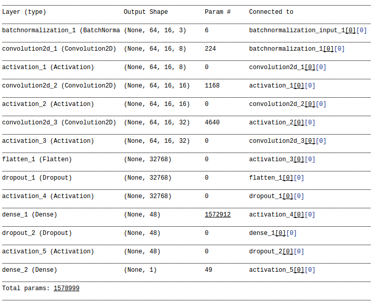

# Behavioral_Cloning
Behavioral cloning on Udacity simulator

dataset.py is the pipeline for image processing and dataset preperation.

model.py is used to train the model.

drive.py is for steering angle prediction with model.json and model.h5.

**Data Preperation**

Limited by the hardware, I started buiding the structure with special emphasis on small size of training data, less trial on generating new training data and less number of model parameters.

The final dataset used for training was built on the original sample dataset with more than 8000 images. I replaced about 2000 images with new recordings on weaving back from the edge to the road center. I also included the left & right images for training by adding in an offset on the steering angles (+0.2 for the right, -0.2 for the left). I croped the original image to remove trees and sky. The images were transfered to YUV space and than resized to 64x16 for final training.

The final total number of images is 24000 (18868 for training, 6290 for validation, 2796 for test). Through the Keras ImageDataGenerator, the train image was augmented with random rotation, shifting, zooming between epochs to prevent overfitting.

**Model Architecture** 

The model architecture was built based on the comma.ai sample (https://github.com/commaai/research/train_steering_model.py). One thing I like most about the design from comma.ai is to use ELU(Exponential Linear Unit) for activation instead of Relu, which not only introduces nonlinearity to the model, but also pushes the negative boundry to '-1', such that the trained network can be more robust with noise. However, the initial comma.ai structure was built to deal with 320x160 images with bigger size of convolutional layer, deeper model, and bigger size of training dataset.

My revised structure started from a batchnormalization layer, follows with three 3x3 convolutional layers with depth of 8, 16 and 32. I also keeped the ELU activation between convolutional layers from the original design. The flattened results are than passed through a Dropout layer with an Relu activaton (ELU may be a better choice if I had more images for training, but the experiment turned out to be worse with the current dataset if I kept the activation layer after flatten to be ELU.) After a sencond dense layer, dropout and Relu activation, the final densed output is a single number representing predicted steering angle.

**Training Strategy**

The model is compiled with a default Adam optimizer, the loss function is "mean squared error" for the regression model. The accuray metric is no longer useful in this case.

A data generator is also appllied with batch size of 8, epoch of 6.

**Notes**

Limited by hardware capability and my personal gaming skill of making sharp turns with high speed, the throttle ratio was tuned down to 0.1.

